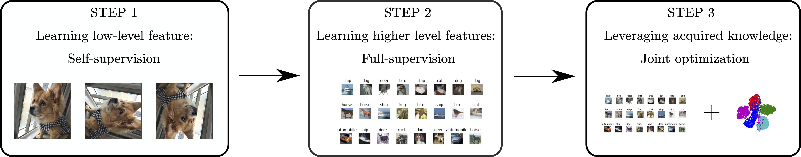

# AutoNovel

**[Automatically Discovering and Learning New Visual Categories with Ranking Statistics, ICLR 2020](http://www.robots.ox.ac.uk/~vgg/research/auto_novel/)**,
<br>
[Kai Han*](http://www.hankai.org), [Sylvestre-Alvise Rebuffi*](http://www.robots.ox.ac.uk/~srebuffi/), [Sebastien Ehrhardt*](), [Andrea Vedaldi](http://www.robots.ox.ac.uk/~vedaldi/), [Andrew Zisserman](http://www.robots.ox.ac.uk/~az/)
<br>




## Dependencies

All dependencies are included in `environment.yml`. To install, run

```shell
conda env create -f environment.yml
```

(Make sure you have installed [Anaconda](https://www.anaconda.com/) before running.)

Then, activate the installed environment by

```
conda activate auto_novel
```

## Overview

We provide code and models for our experiments on CIFAR10, CIFAR100, SVHN, OmniGlot, and ImageNet:
- Code for self-supervised learning
- Code for supervised learning
- Code for novel category discovery
- Our trained models and all other required pretrained models

## Data preparation

By default, we put the datasets in `./data/datasets/` and save trained models in `./data/experiments/` (soft link is suggested). You may also use any other directories you like by setting the `--dataset_root` argument to `/your/data/path/`, and the `--exp_root` argument to `/your/experiment/path/` when running all experiments below.

- For CIFAR-10, CIFAR-100, and SVHN, simply download the datasets and put into `./data/datasets/`.
- For OmniGlot, after downloading, you need to put `Alphabet_of_the_Magi, Japanese_(katakana), Latin, Cyrillic, Grantha` from  `imags_background` folder into `images_background_val` folder, and put the rest alphabets into `images_background_train` folder.
- For ImageNet, we provide the exact split files used in the experiments following existing work. To download the split files, run the command:
``
sh scripts/download_imagenet_splits.sh
``
. The ImageNet dataset folder is organized in the following way:

    ```
    ImageNet/imagenet_rand118 #downloaded by the above command
    ImageNet/images/train #standard ImageNet training split
    ImageNet/images/val #standard ImageNet validation split
    ```

## Pretrained models
We provide our trained models and all other required pretrained models. To download, run:
```
sh scripts/download_pretrained_models.sh
```
After downloading, you may directly jump to Step 3 below, if you only want to run our ranking based method.

## Step 1: Self-supervised learning with both labelled and unlabelled data

```
CUDA_VISIBLE_DEVICES=0 python selfsupervised_learning.py --dataset_name cifar10 --model_name rotnet_cifar10 --dataset_root ./data/datasets/CIFAR/
```

``--dataset_name`` can be one of ``{cifar10, cifar100, svhn}``; ``--dataset_root`` is set to ``./data/datasets/CIFAR/`` for CIFAR10/CIFAR100 and ``./data/datasets/SVHN/`` for SVHN.

Our code for step 1 is based on the official code of the [RotNet paper](https://arxiv.org/pdf/1803.07728.pdf).

## Step 2: Supervised learning with labelled data

```
# For CIFAR10
CUDA_VISIBLE_DEVICES=0 python supervised_learning.py --dataset_name cifar10 --model_name resnet_rotnet_cifar10

# For CIFAR100
CUDA_VISIBLE_DEVICES=0 python supervised_learning.py --dataset_name cifar100 --model_name resnet_rotnet_cifar100 --num_labeled_classes 80 --num_unlabeled_classes 20

# For SVHN 
CUDA_VISIBLE_DEVICES=0 python supervised_learning.py --dataset_name svhn --model_name resnet_rotnet_svhn --dataset_root ./data/datasets/SVHN/
```

## Step 3: Joint training for novel category discovery

### Novel category discovery on CIFAR10/CIFAR100/SVHN

```shell
# Train on CIFAR10
CUDA_VISIBLE_DEVICES=0 sh scripts/auto_novel_cifar10.sh ./data/datasets/CIFAR/ ./data/experiments/ ./data/experiments/pretrained/supervised_learning/resnet_rotnet_cifar10.pth

# Train on CIFAR100
CUDA_VISIBLE_DEVICES=0 sh scripts/auto_novel_cifar100.sh ./data/datasets/CIFAR/ ./data/experiments/ ./data/experiments/pretrained/supervised_learning/resnet_rotnet_cifar100.pth

# Train on SVHN
CUDA_VISIBLE_DEVICES=0 sh scripts/auto_novel_svhn.sh ./data/datasets/SVHN/ ./data/experiments/ ./data/experiments/pretrained/supervised_learning/resnet_rotnet_svhn.pth
```

To train in the Incremental Learning (IL) mode, replace ``auto_novel_{cifar10, cifar100, svhn}.sh`` in the above commands by ``auto_novel_IL_{cifar10, cifar100, svhn}.sh``.

### Novel category discovery on OmniGlot

```shell
# For OmniGlot
CUDA_VISIBLE_DEVICES=0 python auto_novel_omniglot.py 
```

### Novel category discovery on ImageNet

```shell
# For ImageNet subset A
CUDA_VISIBLE_DEVICES=0 python auto_novel_imagenet.py --unlabeled_subset A

# For ImageNet subset B
CUDA_VISIBLE_DEVICES=0 python auto_novel_imagenet.py --unlabeled_subset B

# For ImageNet subset C
CUDA_VISIBLE_DEVICES=0 python auto_novel_imagenet.py --unlabeled_subset C
```

### Evaluation on novel category discovery
To run our code in evaluation mode, set the `--mode` to `test`. 

```shell
# For CIFAR10
CUDA_VISIBLE_DEVICES=0 python auto_novel.py --mode test --dataset_name cifar10 --model_name resnet_cifar10 --exp_root ./data/experiments/pretrained/

# For CIFAR100
CUDA_VISIBLE_DEVICES=0 python auto_novel.py --mode test --dataset_name cifar100 --model_name resnet_cifar100 --exp_root ./data/experiments/pretrained/ --num_labeled_classes 80 --num_unlabeled_classes 20 

# For SVHN
CUDA_VISIBLE_DEVICES=0 python auto_novel.py --mode test --dataset_name svhn --model_name resnet_svhn --exp_root ./data/experiments/pretrained/ --dataset_root ./data/datasets/SVHN

# For OmniGlot
CUDA_VISIBLE_DEVICES=0 python auto_novel_omniglot.py --mode test --model_name vgg6_seed_0 --exp_root ./data/experiments/pretrained/

# For ImageNet subset A
CUDA_VISIBLE_DEVICES=0 python auto_novel_imagenet.py --mode test --unlabeled_subset A --exp_root ./data/experiments/pretrained/

# For ImageNet subset B
CUDA_VISIBLE_DEVICES=0 python auto_novel_imagenet.py --mode test --unlabeled_subset B --exp_root ./data/experiments/pretrained/

# For ImageNet subset C
CUDA_VISIBLE_DEVICES=0 python auto_novel_imagenet.py --mode test --unlabeled_subset C --exp_root ./data/experiments/pretrained/
```
To perform the evaluation in the Incremental Learning (IL) mode, add in the above commands the argument ``--IL`` and replace the model name``resnet_{cifar10, cifar100, svhn}`` by ``resnet_IL_{cifar10, cifar100, svhn}``.

## Citation
If this work is helpful for your research, please cite our paper.
```
@inproceedings{Han2020automatically,
author    = {Kai Han and Sylvestre-Alvise Rebuffi and Sebastien Ehrhardt and Andrea Vedaldi and Andrew Zisserman},
title     = {Automatically Discovering and Learning New Visual Categories with Ranking Statistics},
booktitle = {International Conference on Learning Representations (ICLR)},
year      = {2020}
}
```

## Acknowledgments
This work is supported by the [EPSRC Programme Grant Seebibyte EP/M013774/1](http://seebibyte.org/), [Mathworks/DTA DFR02620](), and [ERC IDIU-638009](https://cordis.europa.eu/project/rcn/196773/factsheet/en).
